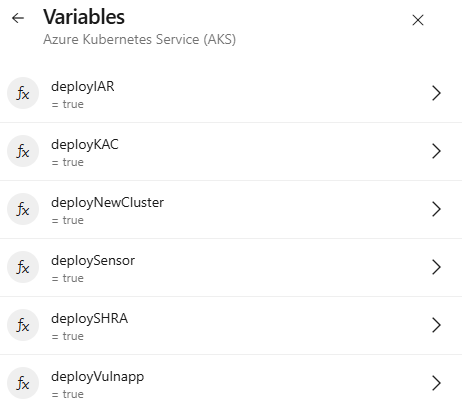
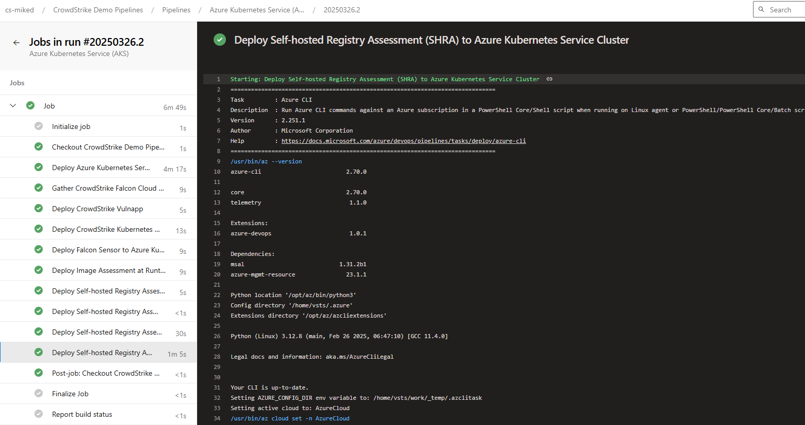

# ado-falcon-aks  

A simple repo that contains a sample Azure DevOps pipeline build that deploys CrowdStrike Falcon Security tools to Azure Kubernetes Services (AKS)

When ran in Azure DevOps variables can be set to dynamically deploy various parts of the build pipeline.

## CrowdStrike Pipeline Variables Documentation

| Variable | Description |
|----------|-------------|
| `fcsClientId` | Falcon API Client ID used for authenticating with CrowdStrike services |
| `fscSecret` | Falcon API Client Secret used for authenticating with CrowdStrike services |
| `fcsCID` | CrowdStrike Customer ID (CID) that uniquely identifies your Falcon environment |

## Azure Environment Configuration

| Variable | Description |
|----------|-------------|
| `azureSubscription` | Azure Subscription ID where resources will be deployed |
| `clusterName` | Name of the Azure Kubernetes Service (AKS) cluster to use/create |
| `clusterResourceGroup` | Azure Resource Group containing the AKS cluster |

## CrowdStrike Registry Paths

| Variable | Description |
|----------|-------------|
| `sensorRegistry` | Container registry path for the CrowdStrike Falcon sensor |
| `kacRegistry` | Container registry path for the CrowdStrike Kubernetes Admission Controller |
| `iarRegistry` | Container registry path for the CrowdStrike Image Analyzer |

## Azure Service Principal Authentication

| Variable | Description |
|----------|-------------|
| `APP_ID` | Azure Service Principal Application ID for authentication |
| `CLIENT_SECRET` | Secret key for the Azure Service Principal |
| `TENANT_ID` | Azure Tenant ID where resources will be deployed |
| `SUBSCRIPTION_ID` | Azure Subscription ID (alternative reference to azureSubscription) |

## Container Registry Configuration

| Variable | Description |
|----------|-------------|
| `acrRegistry` | Azure Container Registry URL where container images will be stored  - example youracr.azurecr.io|
| `DOCKER_USER` | Username for ACR registry authentication |
| `DOCKER_PASSWORD` | Password for ACR registry authentication |
| `DOCKER_EMAIL` | Email address associated with the Docker registry account - can be any value |

## Example Variables

```yaml
variables:
 # Falcon Client ID
 - name: fcsClientId
   value: 'abc123def456ghi789jkl012mnop345'
 # Falcon Secret 
 - name: fscSecret
   value: 'AbCdEf123GhIjKl456MnOpQr789StUvWx'
 - name: fcsCID
   value: 'ABCDEF0123456789ABCDEF0123456789-12'
 - name: azureSubscription
   value: '01234567-89ab-cdef-0123-456789abcdef'
 - name: clusterName
   value: 'aks-example-cluster-prod'
 - name: clusterResourceGroup
   value: 'rg-example-resources'
 - name: sensorRegistry
   value: 'registry.crowdstrike.com/falcon-sensor/us-1/release/falcon-sensor'
 - name: kacRegistry
   value: 'registry.crowdstrike.com/falcon-kac/us-1/release/falcon-kac'
 - name: iarRegistry
   value: 'registry.crowdstrike.com/falcon-imageanalyzer/us-1/release/falcon-imageanalyzer'
 - name: acrRegistry
   value: 'exampleregistry.azurecr.io'
 - name: APP_ID
   value: '01234567-89ab-cdef-0123-456789abcdef'
 - name: CLIENT_SECRET
   value: 'Az9bQ~tH1sIs4s4mPl3S3cR3tV4lU3fOr4pP'
 - name: TENANT_ID
   value: '01234567-89ab-cdef-0123-456789abcdef'
 - name: SUBSCRIPTION_ID
   value: '01234567-89ab-cdef-0123-456789abcdef'
 - name: DOCKER_USER
   value: 'example-user'
 - name: DOCKER_PASSWORD
   value: 'p4ssw0rd-3x4mpl3-d0ck3r-s3cr3t'
 - name: DOCKER_EMAIL
   value: 'example@company.com'

```

## Usage Notes

These variables are used throughout the pipeline to authenticate with CrowdStrike and Azure services, configure deployment settings, and specify the locations of container images and resources.

**Important:** Before running the pipeline, ensure all these values are properly configured according to your environment and that sensitive information (like secrets and API keys) is stored securely using your CI/CD platform's secret management capabilities.

Example Variables:



Example Result:


